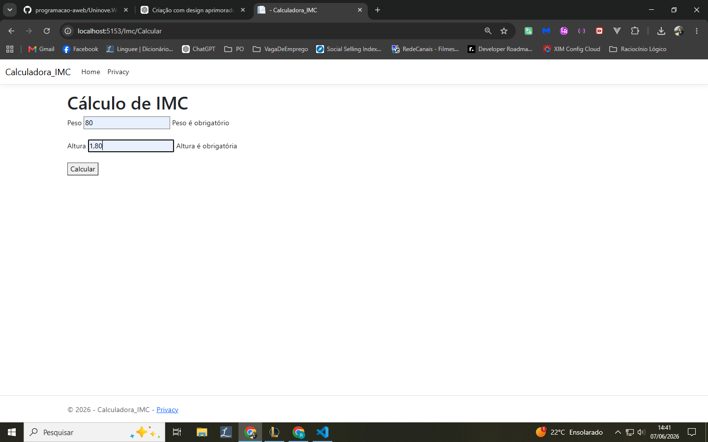
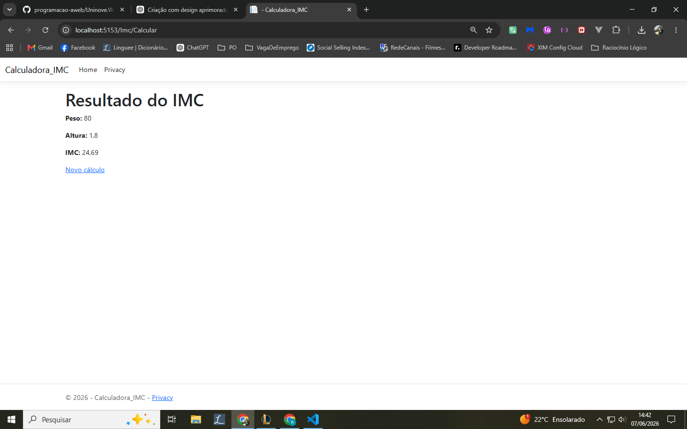

# Calculadora IMC

Aplicação ASP.NET MVC desenvolvida utilizando Models, Controllers e Views.

O sistema recebe o peso e a altura informados pelo usuário através de um formulário.

Após o envio, os dados são processados no Controller (Server Side), onde é realizado o cálculo do Índice de Massa Corporal (IMC) utilizando a fórmula:

IMC = Peso / (Altura × Altura)

O resultado é exibido em uma página mostrando peso, altura e IMC calculado.

Também foram utilizadas Data Annotations para validação dos campos obrigatórios e ModelState para validar os dados recebidos.
